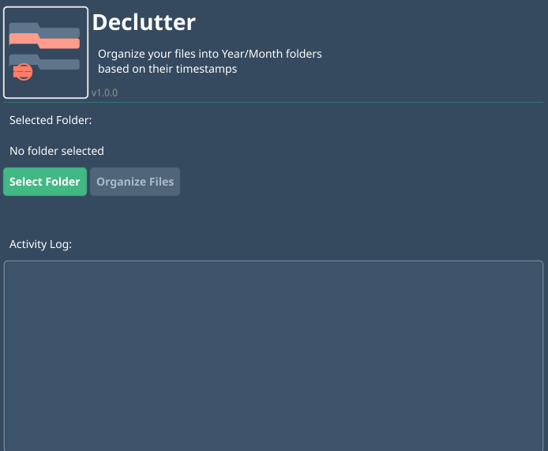
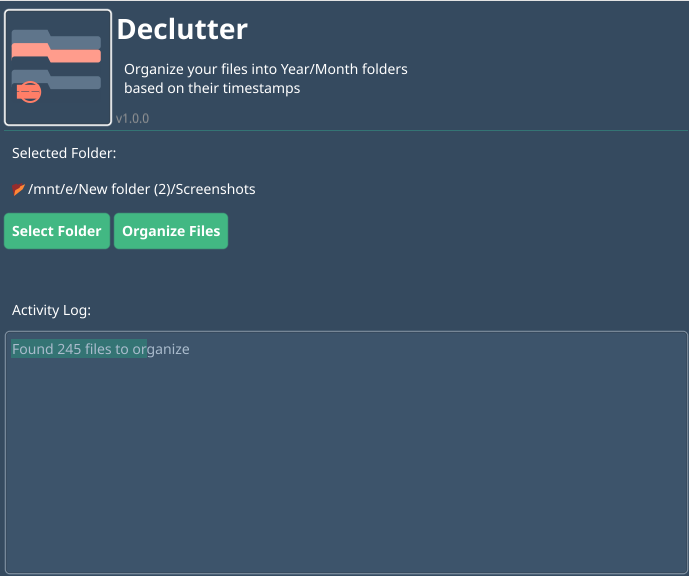
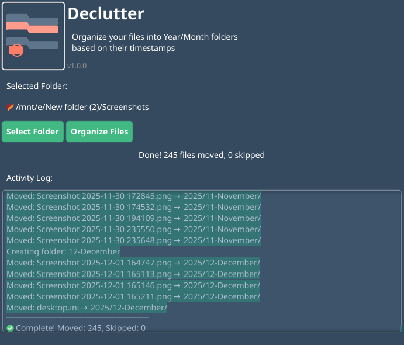

<p align="center">
  
</p>

<h1 align="center">Declutter</h1>

<p align="center">
  <strong>Organize your files into Year/Month folders based on their timestamps</strong>
</p>

<p align="center">
  <a href="https://github.com/dale-tomson/declutter/releases">
    
  </a>
  <a href="https://github.com/dale-tomson/declutter/blob/main/LICENSE">
    
  </a>
  <a href="https://goreportcard.com/report/github.com/dale-tomson/declutter">
    
  </a>
  <a href="https://dale-tomson.github.io/declutter">
    
  </a>
</p>

<p align="center">
  <a href="https://dale-tomson.github.io/declutter">Website</a> •
  <a href="#features">Features</a> •
  <a href="#screenshots">Screenshots</a> •
  <a href="#installation">Installation</a> •
  <a href="#building-from-source">Build</a>
</p>

---

## Features

- 📁 **Auto Organization** — Creates year folders (e.g., `2024`) and month subfolders (e.g., `01-January`)
- 🕐 **Timestamp-based** — Uses file modification dates to determine the correct folder
- 🖥️ **Cross-platform** — Works on Windows, macOS, and Linux
- ⚡ **Fast & Efficient** — Built with Go for blazing fast file operations
- 🎨 **Modern UI** — Clean, intuitive interface built with Fyne
- 🔒 **Safe** — Skips files that already exist at destination, no overwrites

## Screenshots

<p align="center">
  
  <br><em>Launch the application</em>
</p>

<p align="center">
  
  <br><em>Select a folder to organize</em>
</p>

<p align="center">
  
  <br><em>Files organized into Year/Month folders</em>
</p>

## How It Works

1. **Select** a folder containing files you want to organize
2. **Click** "Organize Files" to start
3. **Done!** Files are moved to Year/Month folders

### Before & After

```
Downloads/                          Downloads/
├── vacation.jpg (Mar 2024)         ├── 2023/
├── birthday.jpg (Mar 2024)         │   └── 12-December/
├── christmas.jpg (Dec 2023)   →    │       └── christmas.jpg
└── new-year.jpg (Jan 2024)         └── 2024/
                                        ├── 01-January/
                                        │   └── new-year.jpg
                                        └── 03-March/
                                            ├── vacation.jpg
                                            └── birthday.jpg
```

## Installation

### Download

Get the latest release for your platform from the [Releases page](https://github.com/dale-tomson/declutter/releases) or the [website](https://dale-tomson.github.io/declutter).

| Platform | Download |
|----------|----------|
| Windows  | [declutter-windows.exe](https://github.com/dale-tomson/declutter/releases/latest) |
| macOS    | [declutter-darwin](https://github.com/dale-tomson/declutter/releases/latest) |
| Linux    | [declutter-linux](https://github.com/dale-tomson/declutter/releases/latest) |

> [!IMPORTANT]
> **macOS Users**: When opening the app for the first time, you may see a "Malware" warning. This is because the app is not notarized.
> See our [Gatekeeper guide](docs/MACOS_GATEKEEPER.md) for a safe, one-time workaround (Right-click -> Open).

> [!NOTE]
> **Windows Users**: Windows Defender may show a false positive warning. This is a common issue with Go applications and is completely safe. See our [Windows Defender troubleshooting guide](docs/WINDOWS_DEFENDER.md) for solutions.


### Building from Source

#### Prerequisites

- Go 1.21+
- Platform dependencies:

**Linux:**
```bash
sudo apt-get install libgl1-mesa-dev xorg-dev libxrandr-dev pkg-config
```

**macOS:** Xcode command line tools

**Windows:** MinGW or similar C compiler

#### Build

```bash
git clone https://github.com/dale-tomson/declutter.git
cd declutter
go mod tidy
go build -o declutter .
```

#### Run

```bash
./declutter
```

## Usage

1. Launch Declutter
2. Click **Select Folder** and choose a folder with files to organize
3. Review the file count in the activity log
4. Click **Organize Files** and confirm
5. Watch the progress as files are moved to their Year/Month folders

## Testing

```bash
go test ./...
```

## Project Structure

```
declutter/
├── main.go                 # Application entry point
├── internal/
│   ├── icon/              # Embedded app icon
│   ├── organizer/         # File organization logic
│   ├── theme/             # Custom Fyne theme
│   ├── ui/                # User interface
│   └── version/           # Version information
├── docs/                  # GitHub Pages website
└── scripts/               # Helper scripts (version bumping)
```

## Cross-Compilation

```bash
go install fyne.io/tools/cmd/fyne@latest

fyne package -name "Declutter"              # Current platform
fyne package -os windows -name "Declutter"  # Windows
fyne package -os darwin -name "Declutter"   # macOS
fyne package -os linux -name "Declutter"    # Linux
```

## License

[MIT License](LICENSE) — feel free to use this project for personal or commercial purposes.

## Changelog

See [CHANGELOG.md](CHANGELOG.md) for a list of all changes, or browse individual release notes in the [docs/changelogs](docs/changelogs/) folder.

**Latest: v1.1.3** - macOS packaging improvements (.app bundle), documentation updates, and project restructuring.

## Contributing

Contributions are welcome! Feel free to:

- 🐛 Report bugs by opening an issue
- 💡 Suggest features or improvements
- 🔧 Submit pull requests

---

<p align="center">
  Made with ❤️ using <a href="https://go.dev">Go</a> and <a href="https://fyne.io">Fyne</a>
</p>
